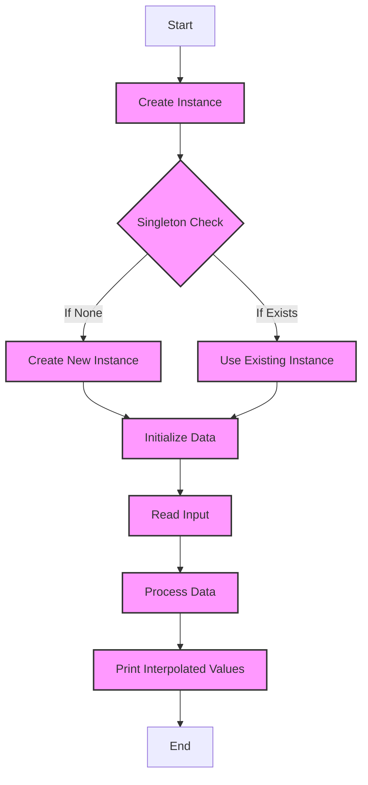

[](https://codecov.io/gh/arturogonzalezm/temperature_predictions)
[](https://github.com/arturogonzalezm/temperature_predictions/blob/master/LICENSE)
[](https://github.com/arturogonzalezm/temperature_predictions/blob/master/docs/temperature-predictions-English.pdf)
[](https://github.com/psf/black)

# Temperature Predictions - HackerRank Challenge

This repository contains the solution to the HackerRank challenge "Temperature Predictions". 
The challenge consists of predicting the temperature of a given day based on the temperatures of the previous days. 
The solution is implemented in Python and the code is documented in the file `temperature_predictions.py`. 
The documentation of the code is available in the file `temperature-predictions-English.pdf`.

## Overview
This Python script reads climate data from standard input, processes this data to interpolate missing values, and prints the interpolated values. It's designed for use directly from the command line and is built to handle tabular data effectively.

## Installation

### Prerequisites
- Python (3.x recommended)
- Pandas library

To install Pandas, you can use pip:

```bash
pip intsall -r requirements.txt
```

# Climate Data Processor Flow

This diagram illustrates the sequence of operations in the Climate Data Processor script:


